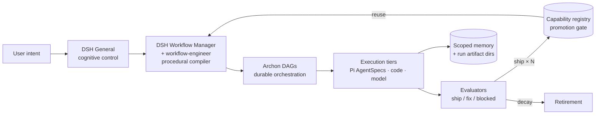

# RCOS — Recursive Capability Operating System

> A workflow-first control plane for heterogeneous executable capabilities with
> eval-driven promotion and retirement. RCOS wires together three existing
> open-source systems — **Pi** (agent specs + execution), **DSH** (cognitive
> control + procedural compiler), and **Archon** (durable orchestration) — into
> one compounding loop. Nothing is vendored: Pi, DSH, and Archon are referenced
> as external dependencies you point at, never copies inside this repo.

**Status:** early public scaffold. The `prototype/` reference implementation and
`benchmarks/` Fam-R suite are landing incrementally; Fam-C / Fam-N and the paper
draft are staged TODOs with schemas defined. See [paper/outline.md](paper/outline.md).

## Conservative abstract

Single-shot agents plateau: they do not accumulate skill. RCOS treats *durable
workflows* as the primary abstraction and *capabilities* (reusable, versioned,
eval-gated units of behavior — prompts, scripts, model nodes, agent teams) as
the asset that compounds. A router selects capabilities per task, an evaluator
scores every execution, and a promotion gate admits a capability to the shared
registry only after repeated shipped results — retiring capabilities whose
performance decays. The claimed result is longitudinal: RCOS starts equal to or
worse than fixed harnesses, then overtakes them as experience accumulates. That
claim is tested by the compounding experiment in `benchmarks/`, not asserted here.

## Architecture (one paragraph + one diagram)

DSH General is the cognitive control surface; the DSH Workflow Manager plus the
workflow-engineer role compiles intent into procedures; Archon DAGs execute those
procedures durably; Pi AgentSpecs (plus code/model tiers) execute steps in
isolation; scoped memory plus per-run artifact directories isolate state; and a
registry plus promotion policy gates what becomes permanent. Full detail:
[ARCHITECTURE.md](ARCHITECTURE.md).



## Quickstart

```bash
git clone https://github.com/Foshowithit/rcos.git
cd rcos
cp .env.example .env   # fill in YOUR Pi/DSH/Archon checkout paths — no secrets
cat INSTALL.md         # prereqs + first dry run (~5 min)
```

Prereqs: `git`, `gh`, `python3`, and (where needed) `node`/`pnpm`. Full steps in
[INSTALL.md](INSTALL.md). There is deliberately no `pip install rcos` yet — the
prototype is interfaces plus a pilot, not a package.

## Repo map

| Path | What lives there |
|---|---|
| `ARCHITECTURE.md` | Component map: control, compiler, orchestration, execution, memory, promotion |
| `INSTALL.md` | Prereqs, env-var wiring to your own Pi/DSH/Archon checkouts, dry-run smoke |
| `.env.example` | Placeholder-only paths/URLs. Never commit a filled `.env` |
| `prototype/` | `capability-registry.json` schema, promotion-gate wiring, router reuse hook, per-task logger. Houses the Fam-R pilot when it lands |
| `benchmarks/` | Fam-R: 15 file-ops / repo-scan / fix-loop tasks, each with prompt + checker + `EVAL.json` gate. Fam-C + Fam-N staged with schema |
| `paper/` | Two-stage publication plan: v1 outline, conservative abstract, 12-section skeleton stubs |
| `.github/` | PR template, bug + capability-proposal issue templates, minimal CI (markdown lint, JSON schema check, pilot smoke) |
| `CONTRIBUTING.md` | How to contribute, commit hygiene, security rules |
| `CODE_OF_CONDUCT.md` | Conduct-lite: be decent, no harassment, maintainers may remove |

## Benchmarks overview

- **Fam-R (reproducible):** 15 deterministic tasks — file ops, repo scans,
  fix-loops — each with a prompt, a script checker, and an `EVAL.json` gate.
  Runnable today; see [benchmarks/README.md](benchmarks/README.md).
- **Fam-C (compounding, staged):** repeated-task families measuring reuse rate
  and cost-per-task decay over time. Schema defined, tasks TODO.
- **Fam-N (novelty/generalization, staged):** held-out tasks measuring transfer
  of promoted capabilities. Schema defined, tasks TODO.

## Compounding-experiment figure (placeholder)

```
cost-per-task  ^
               |  fixed harness  ─────────────  (flat)
               |  RCOS  ╲                          ╲___
               |        ╲_______________________________  (decays as reuse compounds)
               +-------------------------------------------------> tasks completed
```

The real figure is produced by running Fam-C after the pilot lands; until then
this is a hypothesis sketch, not a result. Generating it is tracked as a TODO in
`benchmarks/`.

## Contributing

Small, reviewable PRs. Security hygiene is a merge requirement: no keys, tokens,
credentials, or vault contents — CI greps for them. See [CONTRIBUTING.md](CONTRIBUTING.md).

## Code of conduct (lite)

Be decent. No harassment, no hate, no spam. Assume good faith; disagree with the
work, not the person. Maintainers may warn, then remove, anyone who persistently
degrades the commons. Full short text: [CODE_OF_CONDUCT.md](CODE_OF_CONDUCT.md).

## License

MIT. See [LICENSE](LICENSE). This license choice is deliberate: MIT is permissive
and compatible with the Pi / DSH / Archon open-source ecosystem this project
builds on.

## Acknowledgements + related work

RCOS stands on existing open-source work and does not fork or vendor it:

- **[Pi](https://github.com/badlogic/pi-mono)** — AgentSpecs, model/code tiers,
  isolated execution. Referenced via `PI_CHECKOUT` env var, never copied.
- **DSH (DeepSeek Harness)** — General cognitive control, Workflow Manager,
  workflow-engineer / router / builder / evaluator / verifier roles, promotion
  policy. Referenced via `DSH_CHECKOUT`.
- **Archon** — durable DAG orchestration, workflow library, eval gates.
  Referenced via `ARCHON_CHECKOUT` / `ARCHON_WORKFLOWS`.

Related ideas we learned from (independent projects, no affiliation):
**FlowEvo**, **Voyager** (skill-library compounding in Minecraft),
**AWM / Agentic Workflow Memory**. The RCOS novelty claim is narrower than any
of these: heterogeneous executable capabilities under a workflow-first control
plane with eval-driven promotion *and retirement*, tested by a longitudinal
overtaking experiment. Prior-art comparison belongs in the paper
(`paper/outline.md` § related work).
